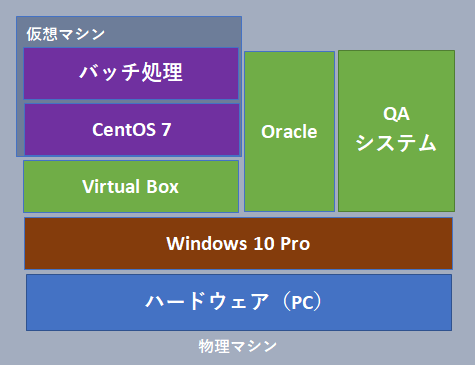

## 概要
学習目的でC言語とOracleを使用したアプリケーションの開発をしてみた。

## システム構成
##### 実行マシン / DBサーバ
 - 物理
 - Windows 10 Pro
 - Oracle 11g
 - VirtualBox
 - WinSCP
##### バッチサーバ
 - 仮想
 - CentOS 7



## システム仕様
#### 実行マシン / DBサーバ
##### 【QA機能】
* カテゴリと問題数を引数とし、「QA.exe」を実行すると開始される。  
* 問題は指定したカテゴリの中からランダム出題される。  
* 問題への回答はA,B,C,Dの4択から選択できるようにする。  
* 回答の正解、不正解は全ての問題を回答した後に出力するようにする。  
* 問題に対する「出題数」と「正解数」を累計データとしてDB上に保存する。  
* プログラムの実行結果内容については*1「%日時%-%カテゴリ%-%名前%.txt」で出力をする。  
* 実行結果ファイルの出力先は「.\data」配下とする。  

##### 【ファイル転送機能】  
* 出力されたファイルはLinuxへWinSCPを利用してファイル転送をする。  
* WinSCPが存在しない環境で実行した場合は転送処理を実行しない。（正常終了）  
* ファイル転送先は「/qa_system/data」配下とする。  

##### 【エラー制御】  
* 画面上にメッセージが表示されること。  
* メッセージについては種類がアプリケーションのイベントログに出力をする。  

#### バッチサーバ
##### 【アーカイブ機能】
* 結果出力ファイルをzip形式で圧縮をし、4世代保持する。
* zipファイル名の形式は*2「%年月%-QA_SYSTEM-%数字%.zip」とする。
* 圧縮対象となる結果出力ファイルが存在しない場合はローテーションを行わず正常終了する。
* バッチは毎週水曜日の14:10に実行するようにする。

##### 【エラー制御】
* 画面上にメッセージが表示されること。
* メッセージについては/var/log/messagesに出力をする。

## 画面イメージ
```
> ./qa.exe Linux 3
名前を入力してください。
佐藤 一郎
*** Linuxに関する問題を3問出題します。 ***
----------------------------------------------------------------------------------
 Q1.コマンドの簡単な説明を表示するコマンドとして適切なのはどれか。
A. whatis　B. which　C. type　D. Apropos
A
----------------------------------------------------------------------------------
 Q2.カレンダーの表示コマンドとして適切なのはどれか。
A. calendar　B. cal　C. date　D. datetime
C
----------------------------------------------------------------------------------
 Q3.日付の表示コマンドとして適切なのはどれか。
A. calendar　B. cal　C. date　D. datetime
A
----------------------------------------------------------------------------------
【結果】
3問中2問正解しました。（正解率：66%）
Q1. ○
Q2. × 正解はB
Q3. ○

「202008041611-Linux 佐藤 一郎.txt」というファイル名で出力されました。
```
